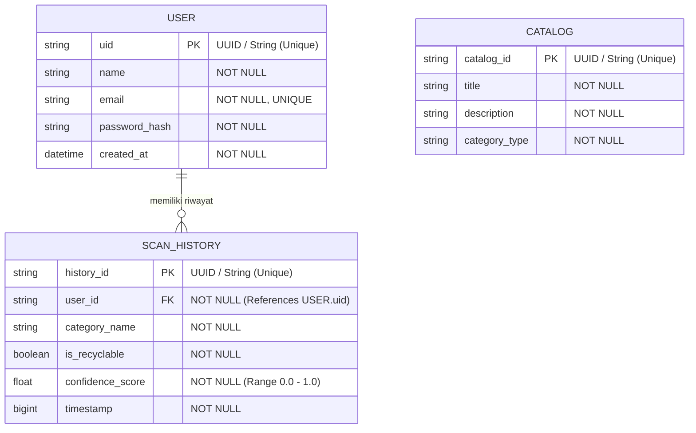

Berikut adalah rancangan lengkap **ERD (Mermaid)** dan **Skema Pydantic v2 (Python)** untuk aplikasi **Wastify**, disusun sinkron dengan spesifikasi OpenAPI dan LLD yang telah kita buat:

---

## 1. ERD (Entity-Relationship Diagram) - Format Mermaid

*[ASUMSI-02]: Entitas `CATALOG` berdiri sendiri sebagai referensi edukasi statis yang dapat diakses oleh semua pengguna tanpa relasi langsung *foreign key* ke tabel riwayat di database.*

---
