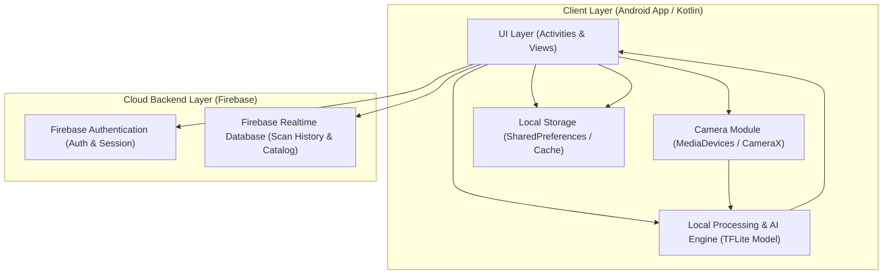

Berikut adalah Draf **High-Level Design (HLD)** untuk aplikasi **Wastify** berdasarkan dokumen PRD, SRS, serta rangkaian User Story dan Acceptance Criteria dari Pertemuan 3:

---

## 1. Diagram Arsitektur Sistem (Mermaid)

---

## 2. Deskripsi Komponen & Tabel Trade-Off Keputusan AI

### A. Deskripsi Komponen Utama

* **UI Layer (Android App):** Bertanggung jawab atas antarmuka pengguna, navigasi layar (Halaman Utama, Login, Kamera, dan Result Screen), serta penanganan status visual (*loading* dan *fallback*).
* **Camera Module:** Mengambil bingkai gambar (*frame*) mentah dari kamera perangkat dan melakukan validasi awal kualitas gambar (resolusi dan pencahayaan).
* **Local Processing & AI Engine (TFLite):** Menjalankan pra-pemrosesan data (*resize* matriks RGB) serta inferensi model *TensorFlow Lite* secara mandiri (*offline*) di perangkat pengguna.
* **Firebase Cloud Backend:** Menyediakan layanan autentikasi pengguna secara aman (`Firebase Auth`) dan penyimpanan sinkronisasi riwayat pemindaian (`Firebase Database`).

### B. Tabel Trade-Off: AI *On-Device* (TFLite) vs *Cloud API*

| Parameter | AI On-Device (TFLite) - *Rekomendasi* | Cloud AI API (e.g., Vision API) |
| --- | --- | --- |
| **Akurasi** | Cukup tinggi (Target $\ge 80\%$ F1-Score) untuk 5–7 kategori sampah domestik. | Sangat tinggi (model umum berskala besar). |
| **Latensi** | Sangat cepat ($\le 2,0$ detik) karena berjalan lokal tanpa hambatan jaringan. | Bergantung pada koneksi internet, rentan terhadap lonjakan latensi (*delay*). |
| **Biaya** | Gratis (biaya server minim/nol untuk pemrosesan AI). | Berbayar per jumlah permintaan (*pay-per-request*), kurang cocok untuk uji coba mahasiswa. |
| **Privasi** | Tinggi (data gambar diproses dan disimpan secara lokal di perangkat). | Rendah hingga Menengah (data gambar harus diunggah ke server pihak ketiga). |
| **Effort** | Sedang (memerlukan proses konversi model dan optimasi ukuran file $< 25$ MB). | Rendah (implementasi integrasi API lebih instan). |
| **Rekomendasi** | **Dipilih**, karena memenuhi konstrain proyek 1 semester, mendukung operasi *offline*, serta menjaga privasi dan latensi operasional. | Tidak dipilih, terkendala batasan biaya proyek dan ketergantungan jaringan internet. |

---

## 3. Aliran Data End-to-End Fitur AI ★

1. **Input Kamera:** Pengguna mengarahkan kamera ke objek sampah dan menekan tombol *shutter* untuk mengambil gambar matriks RGB mentah.
2. **Preprocessing & Validasi Awal:** Sistem memeriksa kualitas gambar secara lokal (memastikan tidak buram atau terlalu gelap). *Jika gagal*, sistem menampilkan pesan perbaikan (*fallback*). *Jika layak*, gambar diubah ukurannya (*resize* ke $224 \times 224$ piksel) dan dinormalisasi.
3. **Inference TFLite:** Modul model TFLite mengeksekusi perhitungan secara *offline* di perangkat dengan batasan waktu respons maksimal 2,0 detik.
4. **Postprocessing & Confidence Check:** Sistem membaca skor probabilitas tertinggi dari model.
* Jika *confidence level* $\ge 50\%$, sistem melanjutkan ke tampilan hasil otomatis.
* Jika *confidence level* $< 50\%$ (*low confidence*), sistem memicu jalur cadangan (*fallback*) dengan meminta pengguna mengarahkan ulang kamera agar tidak terjadi kesalahan tebak (*random guess*).

5. **Output & Penyimpanan:** Layar Hasil (*Result Screen*) merender kategori sampah dan status *recyclable* (Ya/Tidak), lalu data riwayat disinkronkan ke penyimpanan lokal/cloud secara asinkron.

---

## 4. Kontrak Antarkomponen Tingkat Tinggi

* **Autentikasi (`Client ↔ Firebase Auth`):**
* *API/Metode:* `FirebaseAuth.signInWithEmailAndPassword()` & `createUserWithEmailAndPassword()`.
* *Format Data:* Payload JSON berisi *email* dan *hash password* terenkripsi.

* **Penyimpanan Riwayat (`Client ↔ Firebase Database`):**
* *API/Metode:* `DatabaseReference.setValue()` / *push events*.
* *Format Data:* Objek JSON terstruktur (`userId`, `timestamp`, `categoryName`, `isRecyclable`).

* **Komunikasi AI Internal (`UI Layer ↔ TFLite Engine`):**
* *Format Data Masukan:* Array matriks piksel RGB ternormalisasi (ukuran $224 \times 224 \times 3$).
* *Format Data Keluaran:* Array *float* skor probabilitas kelas (0.0 s.d. 1.0) dan *string* label kategori dominan.

---

## 5. Penempatan Security & Privacy by Design

* **Autentikasi & Sesi:** Menggunakan token akses aman bawaan *Firebase Authentication* untuk memvalidasi status login pengguna secara berkala.
* **Keamanan Kata Sandi:** Sandi pengguna wajib di-*hash* secara otomatis menggunakan protokol enkripsi standar industri (*bcrypt/PBKDF2*) di sisi *backend* sebelum disimpan ke basis data.
* **Privasi Citra AI:** Seluruh proses ekstraksi dan klasifikasi gambar sampah dilakukan secara *on-device* (*offline*), sehingga foto pribadi pengguna tidak perlu diunggah sembarangan ke *cloud server*, menjaga prinsip kerahasiaan data (*confidentiality*).
* **Logging & Error Handling:** Sistem mencatat galat sistem lokal secara aman tanpa menampilkan informasi sensitif perangkat ke antarmuka pengguna.

---

## 6. Lingkungan Deployment Ringkas

* **Development:** Dijalankan secara lokal di komputer pengembang menggunakan *Android Studio Emulator* dan perangkat uji fisik Android (minimum Android 8.0 / Oreo, RAM 3 GB) dengan integrasi mode *debug* Firebase.
* **Staging:** Pengujian internal terpusat menggunakan berkas *APK build preview* yang didistribusikan langsung ke perangkat penguji kelompok untuk memvalidasi kestabilan latensi AI dan koneksi basis data.
* **Production:** Tahapan rilis purwarupa terbatas untuk evaluasi akhir mata kuliah, di mana APK stabil dipublikasikan secara manual atau melalui repositori *GitHub Releases* untuk diinstal oleh dosen pengampu/penguji.

---

*Catatan Desain Tambahan:* `[ASUMSI-09]` Kapasitas penyimpanan riwayat lokal maksimal dibatasi hingga 50 data terakhir pada memori *cache* perangkat guna menjaga penggunaan RAM tetap berada di bawah batas spesifikasi NFR ($\le 150$ MB).