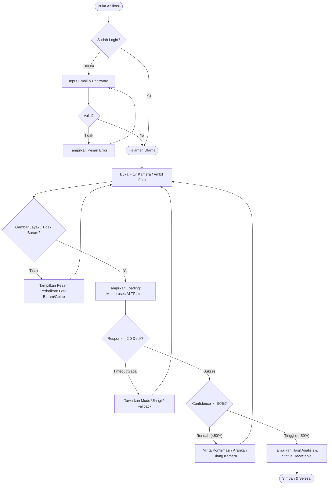

Berikut adalah Draf *User Stories* untuk aplikasi Wastify berdasarkan instruksi dan konteks yang telah diberikan:

## 1. Tabel User Story

| ID Story | Narasi ("Sebagai , saya ingin , agar ") | FR Asal | Prioritas MoSCoW | Kategori |
| --- | --- | --- | --- | --- |
| **US-01** | Sebagai Budi, saya ingin memvalidasi kredensial login dengan email dan password, agar akun pribadi saya aman dan dapat mengakses sistem secara personal. | FR-01

 | Must Have

 | Fitur Inti |
| **US-02** | Sebagai Budi, saya ingin mendaftarkan akun baru melalui sistem, agar saya memiliki profil akses terverifikasi di dalam aplikasi. | FR-02

 | Must Have

 | Fitur Inti |
| **US-03** | Sebagai Budi, saya ingin memproses gambar sampah dari kamera secara *offline*, agar sistem dapat mengenali kategori sampah secara instan tanpa hambatan koneksi internet. | FR-03

 | Must Have

 | Fitur AI ★ |
| **US-04** | Sebagai Budi, saya ingin melihat status kelayakan daur ulang (*recyclable* atau tidak) di layar hasil, agar saya tahu secara pasti bagaimana cara membuang sampah tersebut dengan benar. | FR-04

 | Must Have

 | Fitur AI ★ |
| **US-05** | Aspek Pengguna: Sebagai Budi, saya ingin data riwayat pemindaian saya tersimpan otomatis saat terhubung internet, agar saya dapat memantau progres pemilahan sampah saya sebelumnya. | FR-05

 | Should Have

 | Fitur Inti |
| **US-06** | Sebagai Budi, saya ingin mengakses daftar informasi atau katalog jenis sampah, agar pengetahuan saya bertambah mengenai cara pengelolaan sampah mandiri. | FR-06

 | Should Have

 | Fitur Inti |

---

## 2. Evaluasi Singkat Prinsip INVEST Per Story

* **US-01 (Login) & US-02 (Registrasi):**
* *Independent:* Ya, dapat dikembangkan terpisah dari fitur pemindaian.
* *Negotiable:* Ya, detail input kredensial dapat disesuaikan.
* *Valuable:* Memberikan keamanan akses bagi pengguna.
* *Estimable & Small:* Ukuran kecil dan mudah diestimasi waktu pembuatannya.
* *Testable:* Sangat mudah diuji dengan skenario data valid dan invalid.

* **US-03 (Pemrosesan AI *Offline*):**
* *Independent:* Dapat diuji fungsionalitas kameranya terpisah dari cloud, meskipun bergantung pada hasil model TFLite.
* *Valuable:* Merupakan inti solusi dari masalah kebingungan pemilahan sampah.
* *Estimable, Small, & Testable:* Cukup kecil jika dibatasi pada fungsi tangkap gambar dan inferensi lokal.

* **US-04 (Tampilan Status *Recyclable*):**
* *Independent:* Dapat dikerjakan setelah data dari US-03 tersedia.
* *Valuable:* Memberikan keputusan akhir yang jelas kepada pengguna.
* *Estimable, Small, & Testable:* Fokus pada penyajian data *flag* hasil AI ke antarmuka layar hasil.

* **US-05 (Penyimpanan Riwayat):**
* *Independent:* Dapat berdiri sendiri setelah fitur *scan* dasar berfungsi.
* *Valuable:* Membantu pengguna melacak aktivitas pemilahan sampah.
* *Estimable, Small, & Testable:* Standar penyimpanan basis data lokal/cloud yang mudah diuji.

* **US-06 (Katalog Edukasi):**
* *Independent:* Bersifat statis atau dinamis tanpa mengganggu fitur AI utama.
* *Valuable:* Mendukung misi edukasi pengelolaan sampah.
* *Estimable, Small, & Testable:* Pengujian konten informasi dapat dilakukan dengan mudah.

---

## 3. Pemecahan Epic (Jika Ada Story yang Terlalu Besar)

Secara umum, cakupan draf *user story* di atas sudah cukup spesifik dan memenuhi ukuran *small* untuk satu siklus pengerjaan pendek. Namun, untuk **US-03 (Pemrosesan Gambar AI)**, jika dirasa memiliki kompleksitas tinggi, dapat dipecah menjadi 2 story kecil yang berdiri sendiri:

1. **US-03A:** Sebagai Budi, saya ingin mengambil dan menangkap gambar objek sampah melalui antarmuka kamera ponsel, agar gambar siap untuk diproses.
2. **US-03B:** Sebagai Budi, saya ingin sistem mengeksekusi model TFLite secara *offline* pada gambar yang ditangkap, agar menghasilkan label kategori sampah secara lokal di perangkat.

Berikut adalah hasil *generate* draf **Use Case** formal berdasarkan prompt di atas, yang merinci interaksi pengguna serta penanganan eksepsi khusus AI untuk aplikasi Wastify:

---

## Draf Use Case: Fitur AI Wastify (Tahap 2)

### 1. Use Case Memproses Gambar Sampah via AI (Berdasarkan US-03 & FR-03)

* **ID dan Nama Use Case:** UC-01 — Memproses Gambar Sampah Menggunakan Model AI
* **Aktor Utama:** Pengguna (Budi)
* **Aktor Pendukung:** Layanan Inferensi AI (Model TensorFlow Lite / TFLite lokal)
* **Precondition:**
* Aplikasi terbuka pada menu kamera pemindai.
* Model TFLite sudah terunduh dan siap dieksekusi secara lokal di perangkat *mobile*.

* **Postcondition:** Sistem berhasil mengeksekusi inferensi gambar dan menghasilkan label kategori sampah yang valid untuk diteruskan ke layar hasil.
* **Alur Utama (Main Flow):**
1. Pengguna mengarahkan kamera ponsel ke objek sampah.
2. Pengguna menekan tombol tangkap gambar (*shutter*).
3. Sistem menangkap bingkai gambar (*frame*) dan melakukan normalisasi ukuran piksel sesuai input model.
4. Sistem menjalankan modul inferensi TensorFlow Lite secara lokal (*offline*) di perangkat untuk memproses gambar.

5. Model AI menghitung skor probabilitas untuk setiap kelas kategori sampah dalam waktu maksimal 2,0 detik.

6. Sistem mendeteksi skor probabilitas tertinggi dan meneruskan data kelas kategori tersebut ke layar hasil.

* **Alur Alternatif (Alternative Flow):**
* *3a. Pengguna memilih mengambil gambar dari galeri perangkat:*
1. Pengguna menekan tombol pilihan galeri.
2. Pengguna memilih berkas foto sampah yang tersimpan.
3. Sistem mengambil berkas gambar tersebut dan melanjutkannya ke tahap normalisasi (langkah 3 alur utama).

* **Alur Eksepsi Khusus AI (Exception Flow):**
* *Kualitas masukan data rendah atau buram sebelum dikirim:*
* *Kondisi:* Sistem mendeteksi tingkat ketajaman atau pencahayaan gambar berada di bawah ambang batas standar sebelum masuk ke pemrosesan model.
* *Penanganan:* Sistem membatalkan proses inferensi dan menampilkan pesan peringatan: *"Gambar terlalu buram atau kurang cahaya, silakan posisikan ulang kamera dengan jelas"*.

* *Permintaan ke server AI mengalami timeout atau gagal koneksi:*
* *Kondisi:* Karena pemrosesan menggunakan model TFLite lokal (*offline*), kegagalan koneksi eksternal server tidak terjadi. Namun, jika terjadi kegagalan sistem saat memuat modul memori lokal (*runtime error*):

* *Penanganan:* Sistem menangkap galat (*exception*) secara aman dan menampilkan pesan pemberitahuan: *"Gagal memuat sistem AI pada perangkat, silakan buka ulang aplikasi"*.

* *Skor keyakinan model berada di bawah ambang batas (Low Confidence):*
* *Kondisi:* Model AI menghasilkan skor probabilitas tertinggi di bawah ambang batas minimum 50%.

* *Penanganan:* Sistem dilarang menebak kategori secara acak, lalu memicu mekanisme *fallback* dengan menampilkan pesan: *"Objek sampah tidak dikenali dengan jelas, arahkan kamera lebih dekat atau ambil dari sudut lain"*.

* **Kaitan ke ID User Story dan FR Asal:**
* **ID User Story:** US-03

* **FR Asal:** FR-03

---

### 2. Use Case Menampilkan Status Recyclable (Berdasarkan US-04 & FR-04)

* **ID dan Nama Use Case:** UC-02 — Menampilkan Status Kelayakan Daur Ulang Objek
* **Aktor Utama:** Pengguna (Budi)
* **Aktor Pendukung:** Modul Logika Layar Hasil (*Result Screen*)
* **Precondition:** Proses inferensi AI sebelumnya (UC-01) telah sukses menghasilkan label kategori sampah yang valid.
* **Postcondition:** Pengguna dapat melihat informasi lengkap mengenai kategori sampah dan status daur ulangnya di layar ponsel.

* **Alur Utama (Main Flow):**
1. Sistem menerima data label kategori hasil pemrosesan AI dari UC-01.

2. Sistem membaca atribut status kelayakan daur ulang (`isRecyclable = True / False`) berdasarkan kategori tersebut.

3. Sistem merender Halaman Hasil (*Result Screen*) yang menampilkan visual foto objek, nama kategori, jenis sampah, serta indikator status daur ulang.

4. Pengguna membaca informasi status *recyclable* pada layar.

* **Alur Alternatif (Alternative Flow):**
* *1a. Data hasil klasifikasi dari modul sebelumnya gagal dikirim:*
* Sistem mendeteksi kekosongan data, lalu menampilkan pesan kesalahan pemuatan dan tombol untuk kembali memindai (*rescan*).

* **Alur Eksepsi Khusus AI (Exception Flow):**
* *Tidak ada eksepsi langsung dari model AI pada tahap ini,* karena tahap ini murni menerjemahkan hasil *flag* data dari label yang sudah dipastikan valid oleh sistem di tahap sebelumnya.

* **Kaitan ke ID User Story dan FR Asal:**
* **ID User Story:** US-04

* **FR Asal:** FR-04

Berikut adalah Draf *User Flow* terstruktur untuk fitur AI ★ (Pemindaian Sampah) dan 1 fitur utama lainnya (Autentikasi/Login) pada aplikasi Wastify, dirancang berdasarkan persona Budi serta parameter non-fungsional yang telah ditentukan:

---

## 1. Langkah Alur Pengguna (User Flow)

### A. Alur Fitur Autentikasi / Login (UC-02)

1. **Titik Masuk:** Pengguna membuka aplikasi Wastify di perangkat Android.
2. **Pengisian Data:** Pengguna diarahkan ke halaman login, lalu memasukkan alamat *email* dan kata sandi (*password*) pada kolom form yang tersedia.
3. **Validasi Kredensial:** Pengguna menekan tombol "Login", lalu sistem mengirimkan permintaan verifikasi ke layanan *Firebase Authentication*.
4. **Selesai:** Jika kredensial valid, sistem mengarahkan pengguna menuju Halaman Utama (*Home*). Jika gagal, sistem menampilkan pesan kesalahan autentikasi.

### B. Alur Fitur AI ★ Pemindaian Sampah (UC-01)

1. **Titik Masuk:** Dari Halaman Utama, pengguna memilih menu kamera untuk mulai memindai sampah.
2. **Pengisian Data / Pengambilan Foto:** Pengguna mengarahkan kamera ke objek sampah dan menekan tombol tangkap (*shutter*), atau memilih foto dari galeri perangkat.
3. **Validasi Awal (Status 1):** Sistem melakukan pemeriksaan pendahuluan pada perangkat pengguna untuk memastikan tingkat ketajaman dan pencahayaan gambar layak diproses.
4. **Indikator Proses AI (Status 2):** Jika layak, sistem menampilkan animasi *loading* ringkas sementara model TensorFlow Lite (TFLite) menganalisis gambar secara *offline* dalam batasan waktu maksimal 2,0 detik.

5. **Penanganan Hasil & Jalur Cadangan (Status 3 & 4):**
* *Jalur Cadangan (Fallback / Objek Buram):* Jika gambar terdeteksi buram/gelap pada validasi awal, sistem menolak proses dan meminta pengguna mengambil ulang foto.
* *Penanganan Hasil (Confidence Level):* Jika skor keyakinan model $\ge 50\%$, sistem otomatis menampilkan hasil analisis di Halaman Hasil (*Result Screen*). Jika skor $< 50\%$ (*low confidence*), sistem memicu mekanisme konfirmasi/fallback agar pengguna mengarahkan ulang kamera.

6. **Selesai:** Pengguna melihat informasi kategori dan status daur ulang (*recyclable*), lalu data berhasil disimpan.

---

## 2. Empat Status Sistem pada Fitur AI ★

1. **Validasi Awal di Perangkat Pengguna:**
Sistem mengevaluasi kualitas gambar secara lokal sebelum masuk ke modul AI untuk memastikan gambar tidak terlalu gelap atau buram.
2. **Indikator Proses saat Model AI Menganalisis:**
Sistem menampilkan animasi *loading* interaktif di layar untuk memberi tahu pengguna bahwa pemrosesan lokal sedang berjalan (dengan estimasi latensi maksimal 2,0 detik).

3. **Penanganan Hasil (Akurasi Yakin vs Meragukan):**
* *Yakin ($\ge 50\%$):* Langsung menampilkan detail kategori dan status daur ulang.

* *Meragukan ($< 50\%$):* Menampilkan peringatan ragu-ragu (*low confidence*) untuk menghindari tebakan yang salah.

4. **Jalur Cadangan (Fallback) saat Gagal atau Objek Buram:**
Sistem menyediakan opsi pemulihan berupa instruksi penulisan/pengambilan ulang foto (*rescan*) tanpa membuat aplikasi mengalami *crash*.

---

## 3. Diagram Alur (Format Kode Mermaid)

---

## 4. Tabel Kaitan Alur ke Use Case

| ID Alur / Status | Deskripsi Langkah Alur | Kaitan ke Use Case |
| --- | --- | --- |
| **Alur Autentikasi** | Memasukkan kredensial, validasi sistem, dan masuk ke halaman utama aplikasi. | **UC-02**: Memvalidasi Kredensial Pengguna (Login)

 |
| **Validasi Awal** | Pemeriksaan ketajaman dan pencahayaan gambar secara lokal di perangkat. | **UC-01**: Memproses Gambar Sampah Menggunakan Model AI

 |
| **Indikator Proses AI** | Menampilkan animasi *loading* saat model TFLite mengeksekusi inferensi. | **UC-01**: Memproses Gambar Sampah Menggunakan Model AI

 |
| **Penanganan Hasil** | Menampilkan kategori sampah dan status *recyclable* berdasarkan skor keyakinan. | **UC-01** & **UC-02** (Layar Hasil)

 |
| **Jalur Cadangan (Fallback)** | Mengarahkan ulang pengguna apabila gambar buram atau tingkat keyakinan rendah. | **UC-01** (Alur Eksepsi Khusus AI)

 |

Berikut adalah Draf *Acceptance Criteria* berpola *Given-When-Then* untuk setiap *User Story* aplikasi Wastify beserta usulan metode ujinya:

---

### 1. Acceptance Criteria untuk US-01 (Validasi Kredensial Login)

* **Scenario: Login dengan kredensial yang valid**
* **Given** pengguna berada di halaman login dan telah memiliki akun terdaftar
* **When** pengguna memasukkan format email yang benar dan *password* yang sesuai lalu menekan tombol "Login"
* **Then** sistem memvalidasi data dan mengarahkan pengguna ke Halaman Utama (*Home*) dalam waktu $\le 1,0$ detik

* **Scenario: Login gagal karena format atau data salah**
* **Given** pengguna berada di halaman login aplikasi
* **When** pengguna memasukkan *password* yang salah atau membiarkan kolom form kosong lalu menekan tombol "Login"
* **Then** sistem menolak akses dan menampilkan pesan peringatan kesalahan autentikasi di layar

* **Usulan Metode Uji:** Pengujian Fungsional (*Functional Testing*) dan *Integration Testing* (menguji koneksi API Firebase Auth).

---

### 2. Acceptance Criteria untuk US-02 (Pendaftaran Akun Baru)

* **Scenario: Pendaftaran akun baru berhasil**
* **Given** pengguna baru berada di halaman registrasi akun
* **When** pengguna mengisi kolom nama lengkap, alamat email aktif, dan kata sandi baru sesuai standar lalu menekan tombol "Register"

* **Then** sistem mengenkripsi sandi (*hash*), menyimpan data ke Firebase Auth, dan menampilkan konfirmasi sukses registrasi

* **Scenario: Pendaftaran gagal karena email sudah terdaftar**
* **Given** pengguna baru berada di halaman registrasi akun
* **When** pengguna memasukkan alamat email yang sudah terdaftar di sistem lalu menekan tombol "Register"
* **Then** sistem mendeteksi duplikasi data dan menampilkan pesan error bahwa email sudah digunakan

* **Usulan Metode Uji:** Uji Fungsional (*Functional Testing*) dan *Security Audit* untuk memastikan enkripsi sandi (*hashing*).

---

### 3. Acceptance Criteria untuk US-03 (Pemrosesan Gambar Sampah via AI ★)

* **Scenario: Pemrosesan gambar normal (Happy Path)**
* **Given** aplikasi terbuka pada menu kamera pemindai dan model TFLite aktif secara *offline*

* **When** pengguna mengambil foto objek sampah dengan pencahayaan normal ($\ge 300$ lux) dan menekan tombol tangkap

* **Then** sistem mengeksekusi inferensi model TFLite dalam durasi latensi $\le 2,0$ detik dan menghasilkan label kategori dengan tingkat keyakinan $\ge 50\%$

* **Scenario: Masukan data batas (Edge Case - Gambar Buram / Low Confidence)**
* **Given** aplikasi terbuka pada menu kamera pemindai
* **When** pengguna mengambil foto objek sampah yang buram/gelap atau model menghasilkan skor keyakinan di bawah $50\%$

* **Then** sistem memicu mekanisme *fallback* dan menampilkan pesan instruksi: "Objek tidak dikenali atau gambar buram, arahkan kamera dengan lebih jelas"

* **Scenario: Kegagalan respons atau batas waktu terlewati (Timeout)**
* **Given** modul kamera pemindai sedang memproses bingkai gambar yang kompleks
* **When** proses eksekusi inferensi lokal memakan waktu melebihi batas latensi $2,0$ detik

* **Then** sistem menghentikan proses (*timeout*), mencegah *crash*, dan menawarkan opsi tombol "Coba Ulang" (*Rescan*) kepada pengguna

* **Usulan Metode Uji:** *Performance / Load Testing* (pengukuran *timestamp* latensi), *Accuracy Evaluation* (metrik F1-Score minimal 80%), dan *Unit Test* modul TFLite.

---

### 4. Acceptance Criteria untuk US-04 (Menampilkan Status Recyclable ★)

* **Scenario: Menampilkan status kelayakan daur ulang dengan sukses**
* **Given** sistem telah berhasil menyelesaikan proses inferensi gambar dari US-03

* **When** Halaman Hasil (*Result Screen*) dimuat oleh sistem

* **Then** layar menampilkan rincian kategori sampah, jenis material spesifik, serta indikator status *recyclable* ("Ya" atau "Tidak") secara jelas dalam waktu $\le 1,0$ detik

* **Scenario: Penanganan kegagalan muat data hasil**
* **Given** data label kategori dari modul AI mengalami korupsi data saat dikirim ke antarmuka
* **When** Halaman Hasil berusaha merender informasi *recyclable*

* **Then** sistem menampilkan pesan galat pemuatan data (*error state*) beserta tombol navigasi kembali ke halaman utama

* **Usulan Metode Uji:** *UI Component Testing* dan *Usability Testing* (memastikan informasi mudah dibaca dalam $\le 3$ kali ketukan layar).

Berikut adalah Draf **Matriks Keterlacakan (Traceability Matrix)** untuk aplikasi Wastify yang merangkum hubungan logis dari kebutuhan fungsional awal di SRS hingga rencana pengujian:

| ID Kebutuhan (SRS) | ID User Story | ID Use Case | ID Acceptance Criteria | Komponen Teknis & Model AI | Rencana Uji (P12-P13) |
| --- | --- | --- | --- | --- | --- |
| **FR-01**  | US-01

 | UC-01

 | AC-Login (Valid & Invalid)

 | Komponen Firebase Auth & UI Login

 | Uji Fungsional & Integrasi

 |
| **FR-02**  | US-02

 | UC-02

 | AC-Register (Sukses & Duplikat)

 | Komponen Firebase Auth & Form Database

 | Uji Fungsional & Security Audit

 |
| **FR-03**  | US-03

 | UC-01 (AI Processing)

 | AC-Pemrosesan Normal, Edge Case (Buram/Low Confidence), & Timeout

 | Komponen Model TFLite & UI Kamera

 | Performance Testing & Unit Test

 |
| **FR-04**  | US-04

 | UC-02 (Result Screen)

 | AC-Tampilan Status Sukses & Error State

 | Komponen UI Result Screen & Modul Logika

 | UI Component & Usability Testing

 |

---
